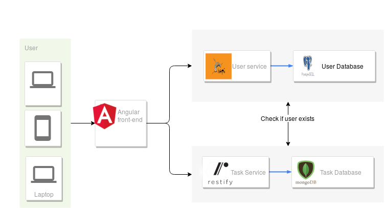

# Tasks

An experiment using different frameworks on backend.

## ~~Live demo~~

~~The project is live on <https://rabbit-task-front.herokuapp.com/>~~

## Architecture

The project is divided on three components:

- frontend: On **_client_** folder, an web app made with angular.
- backend: Microservices, each one with a different framework and database, allows teams to develop independently.
  - User service: On **_server/user_service_** folder, an API made with [happijs](https://hapijs.com/) and  [postgresql](https://www.postgresql.org/)
  - Task service: On **_server/user_service_** folder, an API made with [restify](http://restify.com/) and  [mongodb](https://www.mongodb.com/)

## Run

### Server

To run the services, you need:

- lastest version Node.js and npm
- A MongoDB and Postgres DB, (no is necessary create tables or collections)
- Configure enviroment variables:
  - For users services:
    - `DATABASE_URL`: Postgres DB URL
  - For tasks services:
    - `DATABASE_URL`: Postgres DB URL
    - `USERS_SERVICE_URL`: URL for the tasks service
- Run `npm start` on each folder
- For tests you can run `npm test`

### Client

To run the client app, you need to:

- configure the file `client/src/enviroments/enviroment.ts` (or `client/src/enviroments/enviroment.production.ts` for production) with the services (users and tasks) URL
- Install [Angluar CLI](https://cli.angular.io/) `npm install -g @angular/cli`
- Run `ng serve` on the folder `client`
